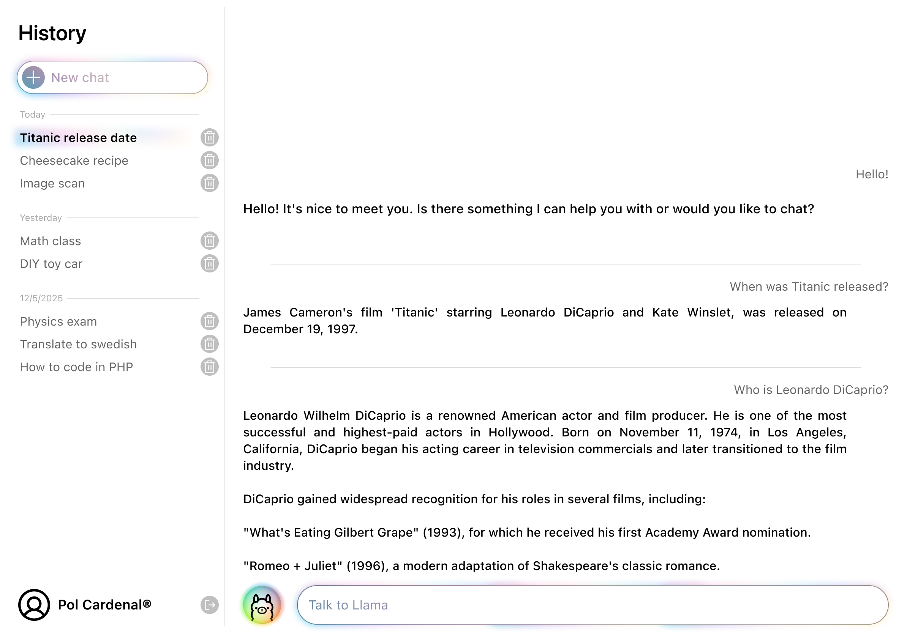
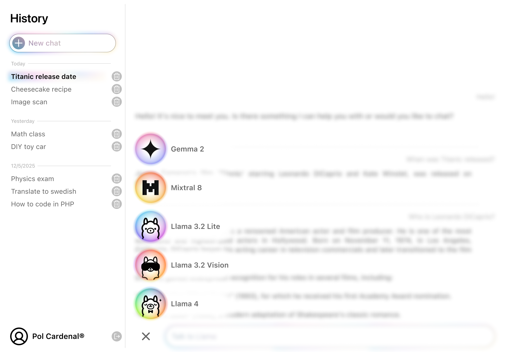
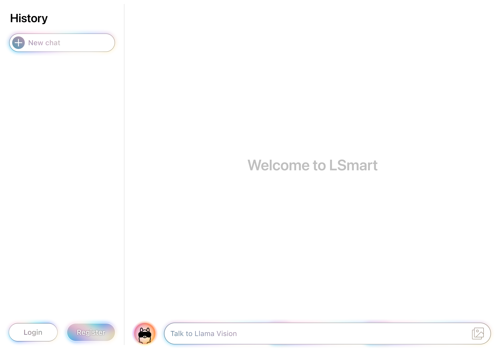

# LSmart

LSmart is a web application that allows users to chat with different LLMs (Large Language Models) and manage their conversations. Chat with the best LLMs available in the market, including text and vision models!

## Prerequisites

To set up and run this web app, you'll need the following:

1. Web server (Nginx)
2. PHP 8
3. MySQL
4. Composer

For this project, please use the provided Docker `pwii-lsmart-environment` setup.

## Requirements

1. Use CodeIgniter as the underlying framework.
2. Use Composer to manage all the dependencies of your application. You must add at least one new dependency.
3. Use Guzzle to make requests to the API.
4. Usage of CodeIgniter's Filters is required.
5. Usage of CodeIgniter's template engine with at least a base template and inheritance is required.
6. Implement CSS to add style to your application. Optionally, you may use a CSS framework. Keep the CSS organized and avoid using raw HTML without styling. Similarly, keep your JS organized and separated from the HTML templates.
7. Use MySQL as the main database management system.
8. Use the provided DB Migration files. Feel free to create new tables or modify the ones provided.
9. Effectively use Object-Oriented Programming principles, including Namespaces, Classes, and Interfaces.
10. The web must be translated into 2 languages. You can choose the languages you want, but at least one of them must be English. The other language can be any other language you prefer.
11. The site must detect the user's language automatically and display the content in that language. If the language is not supported, it should default to English.
12. Use database migrations to create new tables, or alter any of the database tables that we provided.
13. Your environment must be configured as Production when you deliver the project. This means that you must set the environment variable `CI_ENVIRONMENT` to `production` in your `.env` file.

### Use of AI assistants and tools - Disclosure

You are allowed to use AI assistants to search for information and ask questions, but you shall not use AI to generate code. You will need to disclose any AI usage, and if there are concerns about your code's authenticity, you may be asked to provide the source or inspiration for specific code sections.

That being said, we strongly encourage you to try and understand the concepts you're applying and figure out the reason behind any issues you encounter before blindly trying to get a LLM to solve a problem for you. In case of doubt, we recommend consulting a human instead of a machine.

## Resources

### MySQL

Use the provided DB Migration files to create the tables in the MySQL database. Feel free to create new tables or modify the ones provided.

## Sections

The functionalities you must implement in this project can be divided into the following sections:

1. Homepage
2. Sign Up
3. Sign In
4. User Profile
5. History

### Homepage

| Endpoints  | Method |
|------------| ------ |
| /          | GET    |
| /chat/{id} | GET    |

This endpoint will be used to manage all the conversations with the LLMs and chat with them. When the user introduces a text in the input message field and sends it, the system will make an API call using guzzle to the [Groq API](https://console.groq.com/docs/api-reference#chat).

It is NOT required to be logged in to access this endpoint. However, if the user tries to send a message to the LLM whilst being unregistered, the message must be held, the user must be redirected to `/sign-in` and warning them to login using a **flash message**. Once registered and/or logged in, the user will be redirected back to the homepage, and the message will then be sent to the API. The conversation will then proceed.

If the user is logged in, profile (with the user's profile picture) and logout buttons will appear; otherwise, these buttons will show sign in and sign up.

Users can keep different conversations with different LLMs. These conversations will be stored in the database using the `/history` endpoint (which is explained later on) and will be shown in the chat page. The user can select a conversation from the history and continue it. The system will show the messages of the selected conversation and allow the user to send new messages to it.

Users, no matter what conversation they are in, must be able to switch to different LLMs. The system will show a list of available LLMs and allow the user to select one of them. There must be a minimum of 3 LLMs, and one of them must be able to receive images as input.

When an LLM that supports image input is selected, the system will show an image input field. The user can upload an image, and the system will make an API call to the LLM to process the image along with the message the user may attach.

> **IMPORTANT**: LLMs do not retain the context of a conversation across separate API calls. Therefore, you must implement a mechanism to send previous messages along with the user's current message. This involves storing the conversation history in a database and retrieving it when making a new API request.
>
> We recommend including the last 20 messages in each request to maintain a coherent and context-aware conversation.
>
> Additionally, since conversations have titles, consider sending along with the first user message to the LLM a prompt to generate a custom title for the conversation. Otherwise, you can make the user decide the title of the conversation.

### Sign Up

This section describes the process of signing up a new user into the system.

| Endpoints  | Method |
| ---------- | ------ |
| /sign-up   | GET    |
| /sign-up   | POST   |

When a user accesses the `/sign-up` endpoint, you need to display the registration form. The information from the form must be sent to the same endpoint using a **POST** method. The registration form must include the following inputs:

- Username - optional. If users do not provide a username, the system will use the email address as the username (without the domain).
- Profile picture - optional. If users do not provide a profile picture, the system will use a default image.
- Email - required.
- Password - required.
- Repeat password - required.
- I am not a robot (reCAPTCHA) - required.

When a **POST** request is sent to the `/sign-up` endpoint, you must validate the information received from the form and sign up the user only if all the validations have passed. The requirements for each field are as follows:

- Email: It must be a valid email address (@students.salle.url.edu, @ext.salle.url.edu or @salle.url.edu). The email must be unique among all users of the application.
- Password: It must not be empty and must contain at least 8 characters, at least one number and both upper and lower case letters.
- Repeat password: It must be the same as the password field.

If there are any errors, you need to display the sign-up form again. All the information entered by the user should be kept and shown in the form (except for password fields) together with all the errors below the corresponding inputs.

It is required that users pass the reCAPTCHA test. If the test fails, you need to display the form again with all the information provided by the user and display the corresponding error. You must use Google's reCAPTCHA v2.

Here are the error messages that you need to show respectively:

- Only emails from the domain @students.salle.url.edu, @ext.salle.url.edu or @salle.url.edu are accepted.
- The email address is not valid.
- The email address is already registered.
- The password must contain at least 8 characters.
- The password must contain both upper and lower case letters and numbers.
- Passwords do not match.
- Captcha test failed. Please try again.

Once the user's account is created, the system will allow the user to sign in with the newly created credentials.

### Sign In

This section describes the process of logging into the system.

| Endpoints  | Method |
| ---------- | ------ |
| /sign-in   | GET    |
| /sign-in   | POST   |

When a user accesses the `/sign-in` endpoint, you need to display the sign-in form. The information from the form must be sent to the same endpoint using a **POST** method. The sign-in form must include the following inputs:

- Email - required.
- Password - required.

When the application receives a **POST** request to the `/sign-in` endpoint, it must validate the information received from the form and attempt to log in the user. The validations for the inputs should be the same as in the registration.

If there are any errors or if the user does not exist, you need to display the form again with all the information provided by the user and display the corresponding error.

Here are the error messages that you need to show respectively:

- The email address is not valid.
- Your email and/or password are incorrect.

After logging in, the user will be redirected to the chat page.

### User Profile

| Endpoints | Method |
|-----------| ------ |
| /profile  | GET    |
| /profile  | POST   |

This endpoint should be accessible from the homepage and must allow users to change their password, profile picture, and username (the email should be displayed but cannot be changed). Users should also be able to enter their age as a numeric value (for example, `24`). Additionally, there should be a logout and a delete account button. If the account is deleted, the user will be logged out, redirected to the homepage, and removed from the database. Access to this endpoint is restricted to logged-in users.

### History

| Endpoints                  | Method |
|----------------------------|--------|
| /history/{id}              | PUT    |
| /history/{id}              | DELETE |
| /history/{id}/message/{id} | PUT    |
| /history/{id}/message/{id} | DELETE |

> **IMPORTANT:** Notice that POST method is not used for history management, but rather PUT and DELETE.

These endpoints will be used to add or remove conversations held with the LLMs as well as its individual messages in them. This means that in the homepage, once the user starts talking to an LLM, a conversation will be created and stored in the database using **PUT** in `/history/{id}`. Users can delete conversations from the homepage using, of course, the **DELETE** method.

History has not **GET** method, meaning conversations must be shown in the homepage next to the chat interface. The conversations can be shown in a list, and the user must be able to select one to continue it. The system will show the messages of the selected conversation and allow the user to send new messages to it. There also must be a button to start a new conversation, along with a button to delete each conversation. Users must also be able to delete messages from the conversation.

Of course, only logged users will be able to use these endpoints.

### Considerations

> **IMPORTANT:** It is required to use guzzle to send messages to the API. However, guzzle operates server-side, requiring a page reload to process and display updated data. This can disrupt the user experience when chatting with the LLM. By researching JavaScript solutions, such as client-side API calls, you can avoid this issue and create a more seamless, dynamic user experience without page reloads.

There is also needed to be taken into account the following considerations:

1. The endpoints described in the previous sections MUST be used exactly as is. You cannot use **/register** or **/login**.
2. You can use downloaded templates to create the views or create them from scratch.
3. As explained before, it is important to give context of the conversation to the LLM. There are other parameters available in the API that you may use to improve the conversation experience.

## Submission

You must upload a .zip file with the filename format `lsmart_<your_login>.zip` containing all the code to the eStudy.

Make sure that everything needed to properly run your code is present in delivery (including the DB Migration files).

> **IMPORTANT:** Make sure to include a `INSTRUCTIONS.md` file with any information you deem necessary for us to understand how to use your application. This is particularly important when it comes to functionalities where you have creative control or multiple implementation options are proposed, as we won't know what choices you made during the development process.

## Evaluation

1. Once the project is delivered, you will be interviewed by the teachers.
2. In this interview, we will validate that you understand the code you have written and the concepts behind it.
3. Check the syllabus of the subject for further information.

### Evaluation Criteria

To grade the project, the distribution of points is as follows:

- Homepage: 3.5p
- User Registration and Login: 2p
- User Profile: 2p
- History: 2.5p
- Other criteria (clean code quality, clean design, etc.): -1.5p